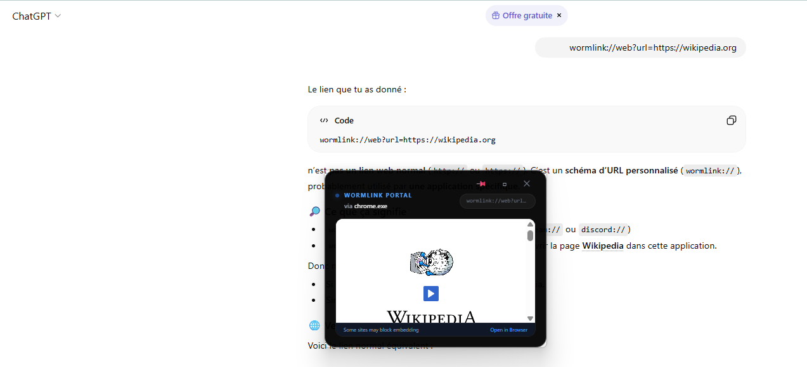

# 🪱 Wormlinks
### Universal Screen Hyperlinks • The "Superpower Layer" for your OS.

[](https://tauri.app/)
[](https://www.rust-lang.org/)
[](https://svelte.dev/)
[](LICENSE)

**Wormlinks** turns *any text on any screen* into a live portal to rich widgets, data, and media—without app developers doing anything. Just type a `wormlink://` tag anywhere (Slack, Notion, Terminal, PDFs) and watch it come to life.

---

## 📺 See it in Action

[](https://youtu.be/yAYcme5FFe4)
*Click the image above to watch the Wormlinks v0.1 Prototype Demo.*

---

## 📥 Downloads (Windows v0.1)

Get the latest "One-Click" installers for Windows 10/11:

- **[🚀 GitHub Releases (Recommended)](https://github.com/Lywald/wormlinks/releases)** — Fast global CDN, always the latest version.
- **[📂 WindowsInstaller Folder](https://github.com/Lywald/wormlinks/tree/master/WindowsInstaller)** — Direct repository access to `.msi` and `.exe` bundles.

---

> [!IMPORTANT]
> **Compatibility**: Currently **Windows 10/11 only**. macOS (AX API) and Linux (AT-SPI2) support are the top priorities on our roadmap.

---

## ✨ The Magic

Imagine typing `wormlink://pdf?path=C:/docs/manual.pdf` in a random Slack message or Notion page. Wormlinks detects it in real-time and renders a beautiful, interactive floating PDF viewer exactly over that text. 

- **Works Everywhere**: Zero friction. No APIs, no plugins, no permissions required from target apps.
- **Privacy First**: Everything runs locally. Your screen data never leaves your machine.
- **Lightweight**: Built with Tauri v2. Tiny binary, sub-second detection, and minimal CPU impact (< 2%).
- **Native Intelligence**: Uses OS Accessibility APIs (UI Automation) for pixel-perfect positioning.

---

## 🤖 LLM Synergy: The AI Interaction Layer

Wormlinks creates a frictionless "UI Bridge" for Large Language Models. By teaching any AI (ChatGPT, Claude, Gemini) the `wormlink://` syntax, you turn your AI chat into a command center for your desktop.

**How it works:**
1. **Brief the AI**: Give it a simple system prompt: *"When you want to show me a document, location, or video, use the `wormlink://` syntax in your response."*
2. **AI Generates a Link**: The AI responds: *"I've found that location for you: wormlink://map?q=Eiffel+Tower"*.
3. **Instant Activation**: As soon as the text appears on your screen, Wormlinks detects it and spawns a live interactive portal right over the AI's chat window.

This effectively gives any LLM **native UI-generation capabilities** across your entire OS, without needing custom plugins or API keys.



---

## 🛠 Supported Widgets (v0.1)

- [x] **`wormlink://image?id=...`** — Dynamic image overlays.
- [x] **`wormlink://youtube?id=...`** — Floating video player.
- [x] **`wormlink://pdf?path=...`** — Integrated document viewer.
- [x] **`wormlink://web?url=...`** — Live website frames.
- [x] **`wormlink://map?q=...`** — Embedded Google/OSM maps.

## 🚀 Getting Started from source

> [!TIP]
> Most users should use the **[One-Click Installers](#-downloads-windows-v01)** above for the easiest experience.

### Prerequisites
- [Rust & Cargo](https://rustup.rs/)
- [Node.js & npm](https://nodejs.org/)

### Development
1. Clone the repo:
   ```bash
   git clone https://github.com/yourusername/wormlinks.git
   cd wormlinks
   ```
2. Install dependencies:
   ```bash
   npm install
   ```
3. Run in development mode:
   ```bash
   npm run tauri dev
   ```

## 🏗 Technical Architecture

- **Core**: Rust (Tauri v2) handling the background polling loop.
- **Screen Intelligence**: Native Windows `UI Automation` (via `uiautomation` and `windows-rs`) to detect text bounds and window coordinates.
- **Frontend**: Svelte 5 + Tailwind CSS for "buttery smooth" transparent overlays.
- **Security**: Widgets run in isolated 'sandboxes' and are strictly limited to reading only the files you choose to display.

## 🗺 Roadmap

- [ ] **Native macOS (AX API)** and **Linux (AT-SPI2)** support.
- [ ] **`/audio`** Mini music player.
- [ ] **`/calc`** Instant calculator widget.
- [ ] **Plugin System** for community-created widgets.

## 🤝 Contributing

Wormlinks is **100% Free & Open Source Forever**. Contributions are welcome! Feel free to open an issue or submit a PR.

---
*Built with ❤️ for power users who want more from their screens.*
